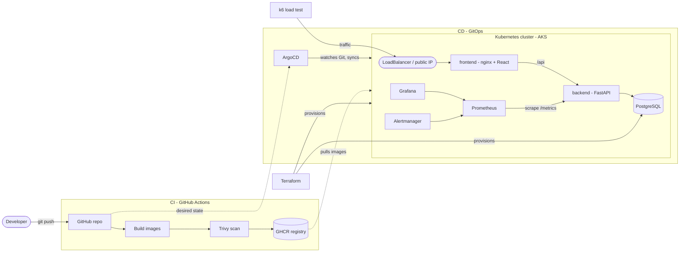
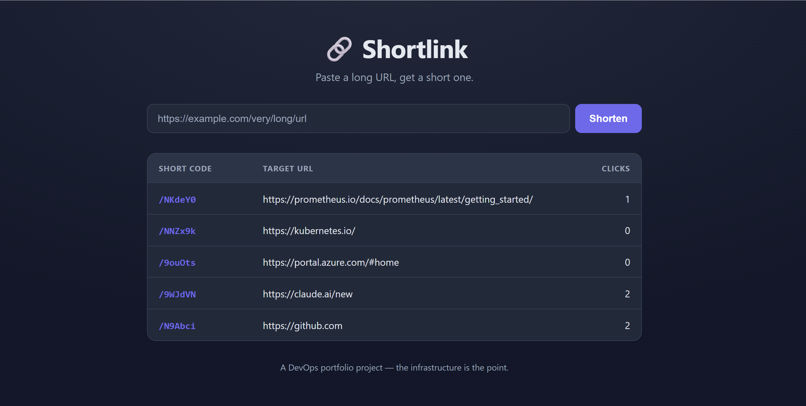
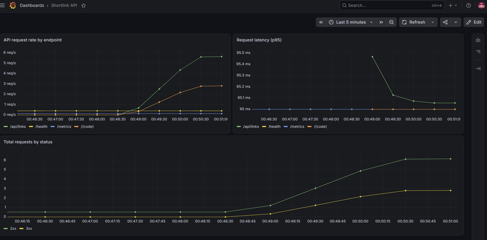
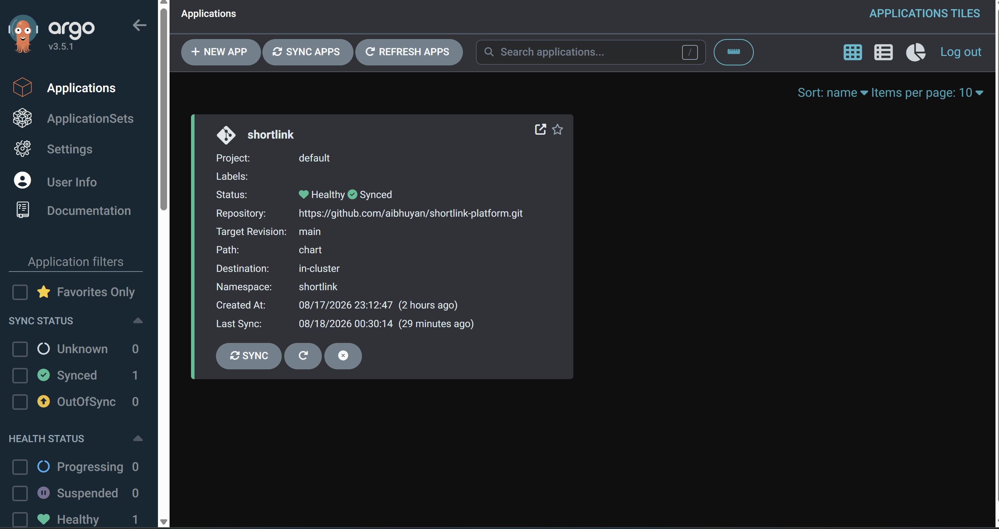
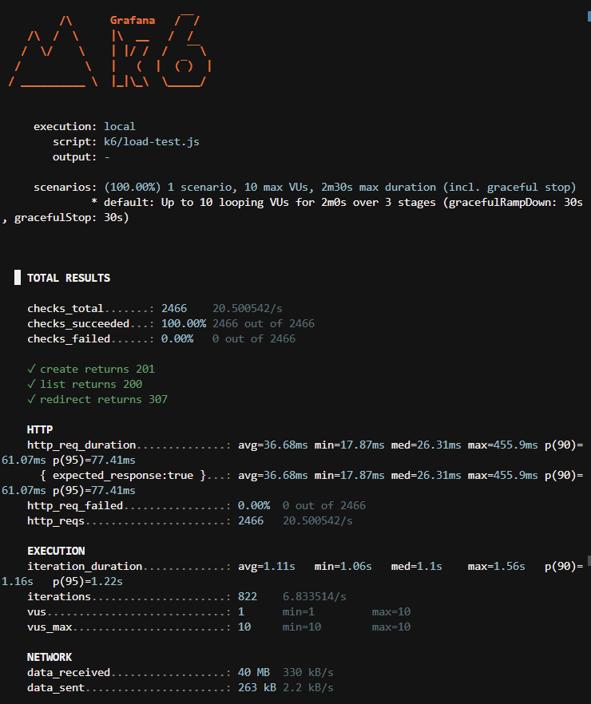

# Shortlink Platform

A production-shaped **URL shortener** built as an end-to-end **DevOps portfolio**: a deliberately simple app (paste a long URL, get a short code, watch click counts) wrapped in a full, realistic delivery pipeline — containers, Kubernetes, GitOps, infrastructure-as-code, CI/CD, and observability.

The app is intentionally boring. **The infrastructure is the point.**

> Paste a long URL → get a short `/{code}` → visiting it redirects and increments a click counter. A table lists every link with its count.

---

## What this project demonstrates

| Area | Tools |
|------|-------|
| **App** | React + Vite + TypeScript, FastAPI (async), SQLAlchemy, Alembic |
| **Data** | PostgreSQL (asyncpg for the app, psycopg for migrations) |
| **Containers** | Docker (multi-stage), Docker Compose, nginx |
| **Orchestration** | Kubernetes (kind locally, AKS in the cloud), Helm |
| **CI/CD** | GitHub Actions, Trivy image scanning, GHCR, ArgoCD (GitOps) |
| **Infrastructure** | Terraform (Azure: AKS + managed PostgreSQL) |
| **Observability** | kube-prometheus-stack (Prometheus, Grafana, Alertmanager), k6 load testing |

---

## Architecture



**Request flow:** the browser only ever talks to nginx (one origin). nginx serves the built React app and proxies `/api` (and short-code redirects) to the FastAPI backend, which talks to PostgreSQL. No CORS, one public entry point — identical in local Compose, kind, and AKS.

---

## Repository layout

```
backend/        FastAPI app, SQLAlchemy models, Alembic migrations, Dockerfile
frontend/       React + Vite + TS app, nginx config, multi-stage Dockerfile
chart/          Helm chart (templates + values); values-aks.yaml for cloud
k8s/            Raw Kubernetes manifests (reference; the chart is the deploy method)
argocd/         ArgoCD Application (GitOps)
terraform/      Azure infra as code (AKS + managed PostgreSQL)
monitoring/     Grafana dashboard JSON
k6/             Load-test script
.github/        CI workflow
command.md      A running log of every command used to build this project
```

---

## Screenshots

**The app**



| Grafana under load | ArgoCD (GitOps) | k6 load test |
|--------------------|-----------------|--------------|
|  |  |  |

---

## Run it locally

The fastest way — the whole stack in Docker Compose:

```bash
cp .env.example .env        # adjust values if you like
docker compose up --build
```

Then open **http://localhost:8080**. Compose runs PostgreSQL, applies migrations (a one-shot job), starts the backend, and serves the frontend through nginx — all on one network.

---

## Deploy to Kubernetes (local, with kind)

```bash
kind create cluster --name shortlink

# build and load images into the cluster
docker compose build
kind load docker-image shortlink-platform-backend:latest --name shortlink
kind load docker-image shortlink-platform-frontend:latest --name shortlink

# deploy with Helm
helm install shortlink chart --namespace shortlink --create-namespace \
  --set postgres.password=<password>
```

The chart is parameterized (`values.yaml`): replica counts, images, an in-cluster **or** external database, ingress on/off, and optional Prometheus `ServiceMonitor`/`PrometheusRule`. Two environments from one chart:

```bash
helm install shortlink-staging chart -n shortlink-staging --create-namespace \
  --set backend.replicas=1 --set frontend.replicas=1 --set ingress.enabled=false \
  --set postgres.password=<password>
```

---

## CI/CD and GitOps

- **CI (GitHub Actions):** on demand, builds both images, scans them with **Trivy**, and pushes to **GHCR** tagged with the commit SHA. CI never touches the cluster.
- **CD (ArgoCD):** watches this repo and syncs the Helm chart onto the cluster. Deployment happens *from Git*, not from a laptop or CI. The cluster's desired state lives in `chart/` + `argocd/application.yaml`.

---

## Infrastructure (Terraform)

`terraform/` provisions real Azure infrastructure — an **AKS** cluster and a **managed PostgreSQL Flexible Server** — from code:

```bash
cd terraform
terraform init
terraform plan
terraform apply     # creates real (billable) resources
# ... and, importantly ...
terraform destroy   # tear it all down promptly
```

Secrets (the DB password) come from a git-ignored `terraform.tfvars`; state (`*.tfstate`) is never committed.

---

## Observability

`kube-prometheus-stack` (Helm) provides Prometheus, Grafana, and Alertmanager. The backend exposes `/metrics`; a **ServiceMonitor** tells Prometheus to scrape it; a **PrometheusRule** defines a `BackendDown` alert; and `monitoring/grafana-dashboard.json` graphs request rate, latency (p95), and status codes.

## Load testing

```bash
k6 run k6/load-test.js          # ramps to 10 VUs against the live app
```

A sample run: **2,466 requests, 100% checks passed, 0% failures, p95 ~77 ms** — while the Grafana dashboards moved in real time.

---

## The build, in phases

Built module-by-module, each on its own branch merged via pull request, with tagged phase boundaries:

- `v0.1-app` — the application (frontend + backend + database)
- `v0.2-docker` — containerized with Docker & Compose
- `v0.3-kubernetes` — running on Kubernetes with Helm
- `v0.4-cicd` — GitHub Actions CI + ArgoCD GitOps
- `v0.5-observability` — Prometheus, Grafana, Alertmanager, k6

---

## Possible future work

The app is intentionally minimal — the infrastructure is the focus. Natural next steps would be:

**App**
- Pagination / search on the links table for large datasets
- Custom short codes and link expiry
- Rate limiting and abuse protection
- Authentication (per-user links)

**AI-assisted operations (planned direction)**

A larger goal for this platform is an **AI agent for Kubernetes operations** — a self-hosted assistant that helps observe and run the cluster:

- An **agent harness** driving a **locally-run LLM** (no external API — the model runs on-cluster / on-prem for privacy and cost control).
- Natural-language **cluster operations** ("why is the backend pod restarting?", "scale the frontend to 4") over guarded access to the Kubernetes API.
- **Automated diagnostics and remediation** — the agent inspects Prometheus metrics, logs, and events to surface root causes and propose (or, with approval, apply) fixes.
- Hooking the agent into the existing **observability** stack so an Alertmanager alert can trigger an AI triage step.
